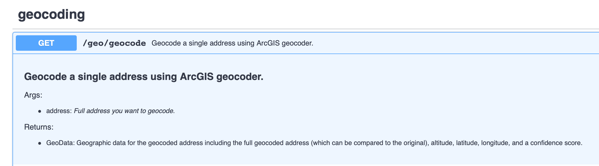
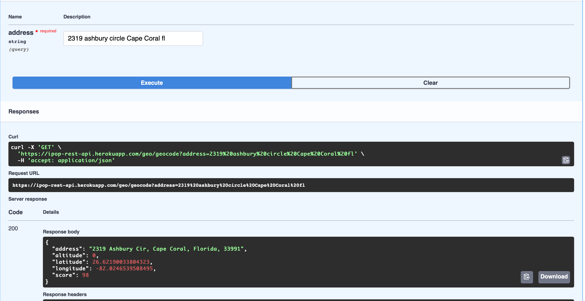

# REST API

  

This project is for a REST-API service that handles various data workloads and tools for the
University of Kentucky's Institute for Pharmaceutical Outcomes and Policy (IPOP) researchers.

## Homepage

You can visit the project website [here](https://ipop-rest-api.herokuapp.com).

## Usage

We have interactive OpenAPI documentation allowing you to consume the endpoints without hassle. We do not recommend sending insecure or HIPPA related data through these services as some of them do utilize external web-services (i.e ArcGIS web server).

\* _Example docs:_

\* _Example response:_

## Requirements

This project requires you have Python 3.9 installed on your system and the
[Poetry](https://python-poetry.org) package manager.

## Installation

To get the project running locally follow these steps:

1. `git clone https://github.com/UK-IPOP/rest-api.git`
2. `cd rest-api`
3. `poetry install`
4. `make run`

> \*\*\*DISCLAIMER\*\*\*:
> You may experience some errors regarding the `/pct_backend` route requiring a GitHub Auth Token. This is a security feature as we do not want those routes being externally manipulated at this time. Feel free to create a `GITHUB_TOKEN` environment
> variable and set it to anything and the code should then run but you will not be
> able to manipulate that route.

You can then see the server running on `http://127.0.0.1:8000`

## License

This project is GNU GP3 licensed, you must disclose your source code and state any changes made.

## Support

If you have any questions or issues you can reach out to me via email (nanthony007@gmail.com) or submit an Issue or Pull Request.
